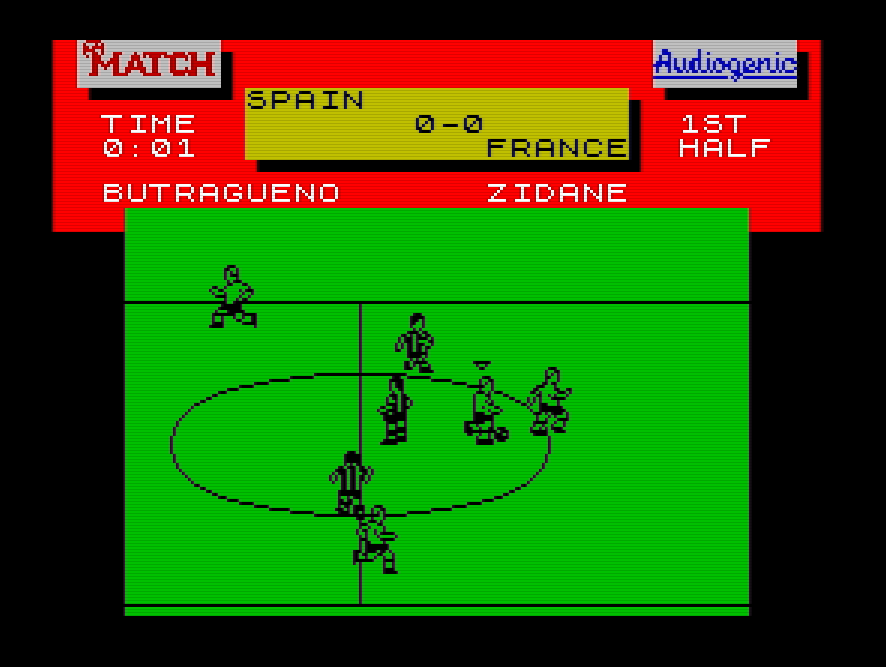

# EHIS Legends

Option file for ZX Spectrum's Emlyn Hughes International Soccer game with great old national teams.

## How to use
* Load Emlyn Hughes International Soccer.
* Go to **Game -> Load All**.
* Escribir en "Enter filename:" **LEGENDS**.
* Press **fire**.
* Put [the **option file** tap](https://raw.githubusercontent.com/rtorralba/EHIS-legends/refs/heads/main/EHIS_legends.tap) in your ZX Spectrum.
* Press **play**.
* **Wait** until load.

## Teams included
* Argentina 86
    * Pumpido
    * Brown
    * Cuciuffo
    * Olarticoechea
    * Giusti
    * Batista
    * Enrique
    * Burruchaga
    * Valdano
    * Maradona
    * Clausen
    * Garre
    * Passarella
    * Trobbiani
    * Tapia
    * Borgui
* Brasil 70
    * Felix
    * Brito
    * Piazza
    * C. Alberto
    * Everaldo
    * Clodoaldo
    * Rivelino
    * Gerson
    * Jairzinho
    * Pele
    * Tostao
    * M. Antonio
    * Joel
    * Fontana
    * Ze Maria
    * Baldocchi
* Inglaterra 66
    * Banks
    * J. Charlton
    * Moore
    * Cohen
    * Wilson
    * B. Charlton
    * Stiles
    * Ball
    * Peters
    * Hurst
    * Hunt
    * Hunter
    * Flowers
    * Byrne
    * Armfield
    * Eastham
* France 98
    * Barthez
    * Blanc
    * Desailly
    * Thuram
    * Lizarazu
    * Deschamps
    * Petit
    * Karembeu
    * Guivarch
    * Zidane
    * Djorkaeff
    * Leboeuf
    * Candela
    * Boghossian
    * Vieira
    * Diomede
* Holanda 88
    * V. Breukelen
    * R. Koeman
    * Rijkaard
    * Van Alerle
    * Van Tiggelen
    * Wouters
    * E. Koeman
    * Vanenburg
    * Muhren
    * Gullit
    * Van Basten
    * Van Cleef
    * Troost
    * Koevermans
    * Winter
    * Kruzen
* España 90
    * Zubizarreta
    * Gorriz
    * Andrinua
    * Chendo
    * Sanchis
    * Villaroya
    * Roberto
    * Michel
    * M. Vazquez
    * Butragueño
    * J. Salinas
    * Alkorta
    * Fernando
    * Quique
    * Jimenez
    * Hierro
* Alemania 90
    * Illgner
    * Kohler
    * Augenthaler
    * Berthold
    * Buchwald
    * Brehme
    * Matthaus
    * Hassler
    * Voller
    * Klinsmann
    * Steiner
    * Pflugler
    * Thon
    * Moller
    * Herman
* Italia 94
    * Pagiuca
    * Costacurta
    * Baresi
    * Benarrivo
    * Maldini
    * D. Baggio
    * Albertini
    * Berti
    * Donadoni
    * R. Baggio
    * Massaro
    * Tassotti
    * Minotti
    * Mussi
    * Apoloni
    * Conte